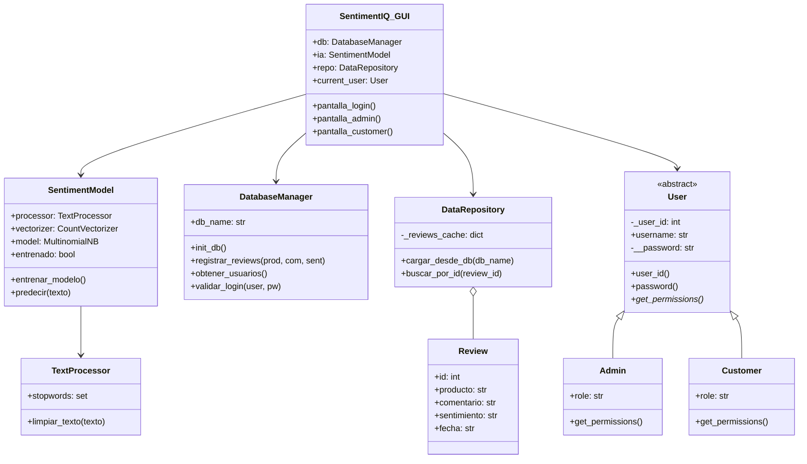
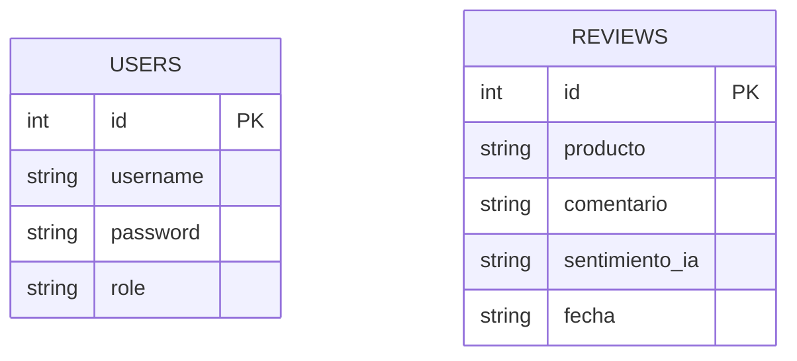

# Sentiment-IQ: Sistema Inteligente de Análisis de Feedback


**Sentiment-IQ** es una herramienta de inteligencia de negocios funcional desarrollada en Python. Su objetivo es procesar reseñas de productos, almacenarlas de forma persistente y clasificar automáticamente la satisfacción del cliente (Positivo/Negativo) utilizando lógica de procesamiento de lenguaje natural y Machine Learning.

## 🛠️ Requerimientos Académicos Integrados

El proyecto cumple con los objetivos de las siguientes materias:

### 1. Programación Orientada a Objetos (POO)
*   **Jerarquía de Clases:** Implementación de `User`, `Admin` y `Customer` con herencia.
*   **Encapsulamiento:** Uso de atributos privados y decoradores `@property` para el manejo seguro de datos (ej. contraseñas).
*   **Polimorfismo:** Métodos abstractos (`get_permissions`) que varían según el tipo de usuario.

### 2. Estructura de Datos
*   **Gestión de Memoria:** Los datos cargados desde la base de datos residen en estructuras dinámicas (`DataRepository`).
*   **Búsqueda Eficiente:** Implementación de búsqueda por **Hash** (diccionarios en memoria) para recuperación instantánea de registros por ID con complejidad O(1).

### 3. Bases de Datos I
*   **Persistencia Relacional:** Uso de **SQLite** para garantizar que la información no sea volátil.
*   **Operaciones CRUD:** Interfaz completa para Crear, Leer, Actualizar y Borrar registros directamente en tablas normalizadas (`users` y `reviews`).

### 4. Sistemas Operativos
*   **Gestión de Logs:** Seguimiento de actividad del sistema en tiempo real (`system.log`).
*   **File System:** Generación automática de reportes detallados en formatos `.csv` y `.xlsx` (Excel).
*   **Concurrencia (Hilos):** Simulación de tareas de respaldo (backup) ejecutándose en hilos secundarios (`threading`) para no bloquear la interfaz principal.

## 📊 Diagramas del Sistema

### 1. Diagrama de Clases (UML)


### 2. Modelo Entidad-Relación (DER)


## 🚀 Instalación y Uso

1.  **Requisitos:**
    *   Python 3.x
    *   Librerías necesarias: `pandas`, `scikit-learn`, `openpyxl`
    ```bash
    pip install pandas scikit-learn openpyxl
    ```

2.  **Ejecutar la Interfaz Gráfica (Recomendado):**
    ```bash
    python gui.py
    ```

3.  **Ejecutar la Terminal (CLI):**
    ```bash
    python main.py
    ```

4.  **Credenciales de Administrador (Default):**
    *   **Usuario:** `admin`
    *   **Contraseña:** `admin123`

## 📁 Estructura del Proyecto

*   `gui.py`: Interfaz gráfica de usuario (Tkinter).
*   `main.py`: Punto de entrada y menú interactivo (CLI).
*   `models.py`: Definición de clases, herencia y lógica POO.
*   `database.py`: Motor de conexión y operaciones SQL.
*   `analysis.py`: IA (Naive Bayes), Procesamiento de Texto y Repositorio de Memoria (Hash Map).
*   `utils.py`: Utilidades de sistema (logs, hilos, exportación CSV/Excel).
*   `sentiment_iq.db`: Base de datos SQLite local.

---
*Desarrollado para el Proyecto Mensual de Inteligencia Artificial - Instituto Profesional de Líderes (Marzo 2026).*
